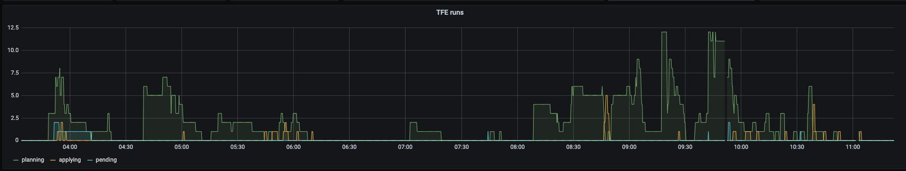

# terraform-enterprise-prometheus-exporter

A prometheus exporter for Terraform Enterprise.

## Docker

```
docker run -p 9112:9112 -e TFE_TOKEN=<some-admin-token> -e TFE_ADDRESS=<some-tfe-address> -e HTTP_LISTENADDR=":9112" -it --rm tfe-prometheus-exporter:latest
```

## Example output

```
# HELP runs_applied Runs applied (applied)
# TYPE runs_applied gauge
runs_applied 7859
# HELP runs_applying Runs currently applying (applying)
# TYPE runs_applying gauge
runs_applying 0
# HELP runs_canceled Runs canceled (canceled)
# TYPE runs_canceled gauge
runs_canceled 5979
# HELP runs_confirmed Runs confirmed (confirmed)
# TYPE runs_confirmed gauge
runs_confirmed 0
# HELP runs_discarded Runs discarded (discarded)
# TYPE runs_discarded gauge
runs_discarded 162
# HELP runs_errored Runs errored (errored)
# TYPE runs_errored gauge
runs_errored 17222
# HELP runs_pending Runs currently in the queue (pending)
# TYPE runs_pending gauge
runs_pending 0
# HELP runs_planned Runs planned (planned)
# TYPE runs_planned gauge
runs_planned 0
# HELP runs_planning Runs currently planning (planning)
# TYPE runs_planning gauge
runs_planning 2
# HELP runs_policy_checked Runs with checked policy (policy-checked)
# TYPE runs_policy_checked gauge
runs_policy_checked 0
# HELP runs_policy_checking Runs currently checking policy (policy-checking)
# TYPE runs_policy_checking gauge
runs_policy_checking 0
# HELP runs_policy_override Runs with overriden policy (policy-override)
# TYPE runs_policy_override gauge
runs_policy_override 0
# HELP runs_total Total number of runs with any status (total)
# TYPE runs_total gauge
runs_total 78922
```

